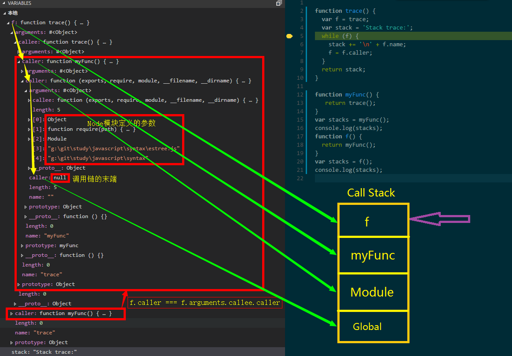
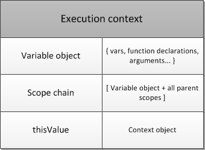
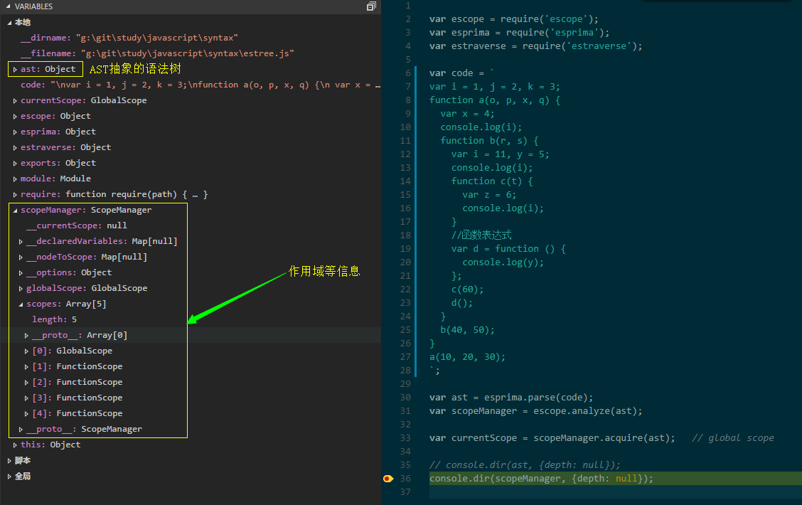

# JavaScript Deep

Focus on concepts，not syntax.

关注概念的理解，而不是语法。

## 执行上下文堆栈


* EC(执行环境或者执行上下文，Execution Context)
* ECS(执行环境堆栈或者执行上下文堆栈，Execution Context Stack)
* VO(变量对象，Variable Object)
* AO(活动对象，Active Object)
* ScopeChain(作用域链)和 `[[scope]]` 属性


有三种类型的ECMAScript代码：

`全局代码`、`函数代码`、`eval代码`


* 每个代码是在其执行上下文（EC）中被求值的。
* 全局上下文只有一个，可能有多个函数执行上下文以及 `eval` 执行上下文。
* 对一个函数的每次调用，会进入到函数执行上下文中，并对函数代码类型进行求值。
* 每次对 `eval` 函数进行调用，会进入 `eval` 执行上下文并对其代码进行求值。


> 注意，一个函数可能会创建无数的上下文，因为对函数的每次调用（即使这个函数递归的调用自己）都会生成一个具有新状态的上下文：

```js
function foo(bar) {}
// call the same function,
// generate three different contexts in each call,
// with different context state (e.g. value of the "bar" argument)
foo(10);
foo(20);
foo(30);
```


一个 `执行上下文(EC)` 可能会触发另一个 `执行上下文(EC)`，如，一个函数调用另一个函数。从逻辑上来说，这是以栈的形式实现的，它叫作 `执行上下文栈(ECS)`。


一个触发其他上下文的上下文叫作 `caller`，被触发的上下文叫作 `callee`，`callee` 在同一时间可能是一些其他 `callee` 的 `caller`。


当一个 `caller` 触发（调用）了一个 `callee` ，这个 `caller` 会暂缓自身的执行，然后把控制权传递给 `callee`，控制权转移。


这个 `callee` 被push到 `执行上下文栈(ECS)` 中，并成为一个 `活动的` `执行上下文`，在 `callee` 的上下文结束后（`callee` 可能简单的返回或者由于异常而退出，一个抛出的但没有被捕获的异常可能退出一个或者多个上下文），它会把控制权返回给 `caller`，然后 `caller` 的上下文继续执行直到它结束，以此类推。


[Caller](https://developer.mozilla.org/en-US/docs/Web/JavaScript/Reference/Global_Objects/Function/caller)

> function.caller[Non-standard]
> The function.caller property returns the function that invoked the specified function.
> If the function f was invoked by the top level code, the value of f.caller is null, otherwise it's the function that called f.
> This property replaces the obsolete arguments.caller property of the arguments object.
> The special property `__caller__`, which returned the activation object of the caller thus allowing to reconstruct the stack, was removed for security reasons.


```js
function f(n) { g(n - 1); }
function g(n) { if (n > 0) { f(n); } else { stop(); } }
f(2);

// f(2) -> g(1) -> f(1) -> g(0) -> stop()

// stop.caller === g && f.caller === g && g.caller === f
```


Example:

```js
function trace() {
  var f = trace, stack = 'Stack trace:';
  while (f) {
    stack += '\n' + f.name;
    f = f.caller;
  }
  return stack;
}

function myFunc() { return trace(); }
var stacks = myFunc();
console.log(stacks);

function f() { return myFunc(); }
var stacks = f();
console.log(stacks);
```


下图是上面代码的函数调用链，对应于 `执行上下文(EC)`，在引擎层面，函数只是 `执行上下文` 的一个属性。





所有ECMAScript程序的运行时可以用 `执行上下文栈（ECS）` 来表示，栈顶是当前 `活动的执行上下文`：


当程序开始的时候它会进入 `全局执行上下文`，此上下文位于栈顶并且是栈中的第一个元素。然后全局代码进行一些 `初始化`。


当初始化完成之后，运行时系统就会等待一些事件，这些事件将会触发一些函数，从而进入新的执行上下文中。


在下个图中，拥有一个 `函数上下文 EC1` 和 `全局上下文 GlobalEC`，当 `EC1` 进入和退出全局上下文的时候下面的栈将会发生变化：


这就是 ECMAScript 的运行时系统如何真正地管理代码执行的。


栈中的每个 `执行上下文` 都可以用一个对象来表示。


让我们来看看它的结构以及一个上下文到底需要什么状态（属性）来执行它的代码。


### 执行上下文


一个执行上下文可以抽象的表示为一个简单的对象。每一个执行上下文拥有一些属性（可以叫作上下文状态）用来跟踪或表示和它相关的代码的执行过程。


在下图中展示了一个上下文的结构：



除了这三个必需的属性 `变量/活动对象`、`作用域链`、`this` 之外，`执行上下文` 可以拥有其他状态，这取决于实现。

让我们详细看看上下文中的这些重要的属性。


### 变量对象（variable object）


`变量对象` 是与 `执行上下文` 相关的 `数据作用域`，所以也可以叫做 `作用域对象`。

它是一个与上下文相关的特殊对象，其中存储了在上下文中定义的 `变量` 和 `函数`。


> 函数表达式（与函数声明相对）不包含在变量对象之中。


变量对象是一个抽象概念。对于不同的上下文类型，在物理上，是使用不同的对象。


在全局上下文中变量对象就是全局对象本身，这就是为什么我们可以通过 `全局对象的属性名` 来关联 `“全局变量”`。


全局变量：

JavaScript中并不存在 `全局变量`，所谓的全局变量，不过是 `Global对象的一个属性`，叫 `全局属性` 还差不多，或者叫 `全局变量对象`，变量和属性虽然都是数据的引用方式，但是却有很大差别。


Example:

```js
var global = global || window;
global.env = 'production';
NODE_ENV = 'production';
console.log(env);
console.log(global.NODE_ENV);
// 访问 全局属性 直接通过属性名就可以了。
// 这也是为什么被误称为 全局对象 的原因之一。
```


让我们在全局执行上下文中考虑下面这个例子：

```js
var foo = 10;
function bar() {}       // function declaration, FD
(function baz() {});    // function expression, FE
console.log(this.foo == foo, window.bar == bar);  // true // true
console.log(baz);       // ReferenceError, "baz" is not defined
```

之后，全局上下文的 `变量对象` 将会拥有如下属性：


函数 `baz` 是一个函数表达式，没有被包含在变量对象之中。这就是为什么当我们想要在函数自身之外访问它的时候会出现 `ReferenceError`。


注意，与其他语言（比如C/C++）相比，在ECMAScript中只有函数可以创建一个新的作用域。在函数作用域中所定义的变量和内部函数在函数外边是不能直接访问到的，而且并不会污染全局变量对象。


使用 `eval` 我们也会进入一个新的执行上下文。无论如何，`eval` 使用全局的变量对象或者使用 `caller`（比如eval被调用时所在的函数）的变量对象。


那么函数和它的变量对象是怎么样的？

在函数上下文中，`变量对象` 是以 `活动对象` 来表示的。

为什么全局上下文中不需要 `活动对象`，而 `变量对象` 就是 `全局对象本身`？

因为 `全局上下文` 只有一个，用 `全局对象` 即可作为 `变量对象` 提供名字查找，而同一函数可能 会同时存在多个 `函数上下文`，每个上下文各不相同，且 `函数上下文` 与 `全局上下文` 又有不同，所以引入了 `活动对象` 来表示 `变量对象`。


### 活动对象（activation object）


当一个函数被 `caller` 调用，一个特殊的对象，叫作 `活动对象`（activation object）将会被创建。


这个对象中包含 `形参` 和 `arguments` 对象（是对形参的一个映射，但是值是通过索引来获取）。

`活动对象` 之后会做为函数上下文的 `变量对象` 来使用。

换句话说，函数的 `活动对象` 就是一个同样简单的 `变量对象`，但是除了 `变量` 和 `函数声明` 之外，它还存储了 `形参` 和 `arguments` 对象，并叫作 `活动对象`。

即：`活动对象` <=> `变量对象` + `形参` + `arguments` + `变量声明` + `函数声明`


全局上下文中并没有 `形参`，更没有 `arguments`，所以和函数上下文不同，这是全局上下文和函数上下文的不同之一。


考虑如下例子：

```js
function foo(x, y) {
  var z = 30;
  function bar() {}     // FD
  (function baz() {});  // FE
}
foo(10, 20);
```

我们看下函数foo的上下文中的活动对象：


函数表达式baz还是没有被包含在 `变量/活动对象` 中。


在ES5中 `变量对象` 和 `活动对象` 被并入了 `词法环境模型`（lexical environments model）。


众所周知，在 ECMAScript 中我们可以使用内部函数，然后在这些内部函数中可以引用父函数的变量或者全局上下文中的变量。

当我们把 `变量对象` 命名为 执行上下文的 `作用域对象`，与上面讨论的原型链相似，作用域对象 可以 形成一条链，叫作 `作用域链`。


### 作用域链(scope chain)


`作用域链` 是一个 `作用域对象`（即：`变量/活动对象`） 列表，代码中出现的标识符在这个列表中进行查找。

这个规则还是与原型链同样简单：

如果一个变量在函数自身的 `作用域对象`中没有找到，那么将会查找它父函数（外层函数）的 `作用域对象`，以此类推。

就上下文而言，标识符指的是：`变量名称、函数声明、形参` 等。


自由变量(free variables)：

当一个函数在其代码中引用一个不是 `局部变量`（或者局部函数或者一个形参）的标识符，那么这个标识符就叫作 `自由变量`，搜索这些 `自由变量` 正好就要用到 `作用域链`。


在通常情况下，`作用域链` 是一个包含所有 `caller的变量/活动对象` 加上（在作用域链头部的）`callee（自身）变量/活动对象` 的一个列表。


这个 `作用域链` 也可以包含任何其他对象，比如，在上下文执行过程中动态加入到作用域链中的对象－像 `with对象` 或者特殊的 `catch从句（catch-clauses）对象`。


当解析一个标识符的时候，会从作用域链中的 `变量对象` 开始查找，然后（如果这个标识符在函数自身的活动对象中没有被查找到）向作用域链的上一层查找－重复这个过程，就和原型链查找一样。


综上：`作用域链` 可以看作是 `变量对象链`。


我们可以假设通过隐式的 `__parent__` 属性 来和 `作用域链对象` 进行交互，这个属性指向作用域链中的下一个对象。

这个方案可能在真实的 Rhino 代码中经过了测试，并且这个技术很明确得被用于ES5的词法环境中（在那里被叫作outer连接）。

作用域链的另一个表现方式可以是一个简单的数组。利用 `__parent__` 概念，我们可以用下面的图来表现上面的例子（并且父变量对象存储在函数的 `[[Scope]]` 属性中）：


```js
var x = 10;
(function foo() {
  var y = 20;
  (function bar() {
    var z = 30;
    console.log(x + y + z);
  })();
})();
```


在代码执行过程中，作用域链可以通过使用 `with语句` 和 `catch从句对象` 来增强。并且由于这些对象是简单的对象，它们可以拥有原型（和原型链）。


这个事实导致作用域链查找变为两个维度：

1. 首先是作用域链连接，然后
2. 在每个作用域链连接上－深入作用域链连接的原型链（如果此连接拥有原型）。


对于这个例子：

```js
Object.prototype.x = 10;
var w = 20;
var y = 30;
// in SpiderMonkey global object i.e. variable object of the global context inherits from "Object.prototype",
// 全局对象(global|window) 依然是 Object 对象的实例，所以会从 Object.prototype 继承 属性和方法
// so we may refer "not defined global variable x", which is found in the prototype chain
console.log(x); // 10
(function foo() {
  // "foo" local variables
  var w = 40;
  var x = 100;
  // "x" is found in the "Object.prototype", because {z: 50} inherits from it
  with ({z: 50}) {
    console.log(w, x, y, z); // 40, 10, 30, 50 // 关键在这里
  }
  // after "with" object is removed from the scope chain,
  // "x" is again found in the AO of "foo" context;
  // variable "w" is also local
  console.log(x, w); // 100, 40
  // and that's how we may refer shadowed global "w" variable in the browser host environment
  console.log(window.w); // 20
})();
```


我们可以给出如下的结构：


> 在 `GlobalVO` 向上查找时，会同时存在 `__parent__` 和 `__proto__`，即 `作用域链` 和 `原型链` 在引擎内部的表示对象上有了交点，在查找 `__parent__` 之前，首先查找 `__proto__` 链，此时，`作用域链` 已到达终点，也不需要继续查找。只在 `GlobalVO` `作用域链` 和 `原型链` 才会有交点。

> 注意，不是在所有的实现中 `全局对象` 都是继承自 `Object.prototype`，但是通常 是这样的。


由于所有 `父变量对象` 都存在，所以在内部函数中获取父函数中的数据没有什么特别－就是遍历作用域链去搜寻需要的变量。


就像上边提及的，在一个上下文结束之后，它所有的状态和它自身都会被销毁，这个上下文（函数）可能会返回另一个函数，这个返回的函数之后可能在另一个上下文中被调用。
如果 `自由变量` 的上下文已经「消失」了，将会出现问题，有一个方式可以帮助我们解决这个问题，叫作 `闭包`，其在ECMAScript 中就是和 `作用域链` 的概念紧密相关的。

父函数上下文被销毁之后，为了满足子函数查找 `自由变量` 的需求，子函数在创建的时候，需要保存父函数的 `执行上下文`，保存的字段 叫 `[[Scope]]`，这一方式被称为 `闭包`。


#### 闭包（closure）


在 ECMAScript 中，函数是一级（`first-class`）对象。这意味着函数可以做为参数传递给其他函数 `「函数类型参数」（funargs）`。

接收 `「函数类型参数」` 的函数叫作 `高阶函数 `。或者，贴近数学一些，叫作 `高阶操作符`。同样函数也可以返回一个函数，`「函数类型值」（funvals）`。


这有两个在概念上与 `「函数类型参数」` 和 `「函数类型值」` 相关的问题。

并且这两个子问题在 `Funarg problem` 中很普遍。为了解决整个 `Funarg problem`，`闭包` 的概念被创造了出来。


`Funarg problem` 的第一个子问题是 `「向上funarg问题」`。它会在当一个函数从另一个函数中返回并且使用上面所提到的 `自由变量` 的时候出现。

为了在即使 `父函数上下文销毁` 的情况下也能访问其中的变量，内部函数在被创建的时候会在它的 `[[Scope]]` 属性中保存 `父函数的作用域链`。


所以当函数被调用的时候，它上下文的作用域链会被格式化成 `活动对象` 与 `[[Scope]]` 属性的和：

`Scope chain = AO + [[Scope]]`。


函数在创建时会保存父函数的 `作用域链`，这个保存下来的 `作用域链` 将会在未来的函数调用时用来 `查找变量`。

如果从对象引用层面来理解，`[[Scope]]` 被另外一个对象（函数）引用，引擎不会回收这些资源，所以闭包容易带来内存泄漏的隐患。


```js
function foo() {
  var x = 10;
  return function bar() {
    console.log(x);
  };
}
// "foo" returns a function and this returned function uses free variable "x"
var returnedFunction = foo();
// global variable "x"
var x = 20;
// execution of the returned function
returnedFunction(); // 10, but not 20
```

这个类型的作用域叫作 `静态（或者词法）作用域`。我们看到 `变量x` 在返回的bar函数的 `[[Scope]]` 属性中被找到。


通常来说，也存在动态作用域，那么上面例子中的 `变量x` 将会被解析成 `20`，而不是 `10`。但是，动态作用域在 ECMAScript 中没有被使用。


`Funarg problem` 的第二个子问题是 `「向下funarg问题」`。它会在当一个函数作为另一个函数的参数并且使用上面所提到的 `自由变量` 的时候出现。

```js
// global "x"
var x = 10;
// global function
function foo() {
  console.log(x);
}
(function (funArg) {
  // local "x"
  var x = 20;
  // there is no ambiguity, because we use global "x", 
  // which was statically saved in [[Scope]] of the "foo" function,
  // but not the "x" of the caller's scope, which activates the "funArg"
  funArg(); // 10, but not 20
})(foo); // pass "down" foo as a "funarg"
```


`词法作用域/静态作用域`：变量的作用域是在 `定义时` 决定而不是 `运行时` 决定，也就是说 `词法作用域` 取决于源码，通过静态分析就能确定，因此词法作用域也叫做静态作用域。`with` 和 `eval` 除外，所以只能说JS的作用域机制非常接近 `词法作用域（Lexical scope）`。


我们可以断定 `静态作用域` 是一门语言拥有 `闭包` 的必需条件。但是，一些语言可能会同时提供动态和静态作用域，允许程序员做选择－什么应该 `包含` 在内和什么不应包含在内。


由于在 ECMAScript 中只使用了 `静态作用域`，所以：ECMAScript 完全支持闭包，技术上是通过函数的 `[[Scope]]` 属性实现的。


现在我们可以给闭包下一个准确的定义：[闭包]( https://zh.wikipedia.org/wiki/闭包_(计算机科学) )

在计算机科学中，闭包（英语：Closure），又称词法闭包（Lexical Closure）或函数闭包（function closures），是引用了自由变量的函数。
这个被引用的自由变量将和这个函数一同存在，即使已经离开了创造它的环境也不例外。
所以，有另一种说法认为闭包是由函数和与其相关的引用环境组合而成的实体。
闭包在运行时可以有多个实例，不同的引用环境和相同的函数组合可以产生不同的实例。

闭包是一个代码块（在ECMAScript是一个函数）和以 `静态方式`/`词法方式` 进行存储的所有父作用域的一个集合体。所以，通过这些存储的作用域，函数可以很容易的找到 `自由变量`。


闭包使得一个函数能够通过作用域链查找到另一个函数作用域中的变量。

闭包影响了作用域链，尤其是那些被销毁的上下文。


注意，由于每个（标准的）函数都在创建的时候保存了 `[[Scope]]`，所以理论上来讲，ECMAScript 中的所有函数都是闭包。


另一个需要注意的重要事情是，多个函数可能拥有相同的父作用域，比如当我们拥有两个内部/全局函数的时候。

在这种情况下，`[[Scope]]` 属性中存储的变量是在拥有相同父作用域链的所有函数之间共享的。


一个闭包对变量进行的修改会体现在另一个闭包对这些变量的读取上：


```js
function baz() {
  var x = 1;
  return {
    foo: function foo() { return ++x; },
    bar: function bar() { return --x; }
  };
}
var closures = baz();
console.log(
  closures.foo(), // 2
  closures.bar()  // 1
);
```


确切来说这个特性在循环中创建多个函数的时候会使人非常困惑。在创建的函数中使用循环计数器的时候，一些程序员经常会得到非预期的结果，所有函数中的计数器都是同样的值。


```js
var data = [];
for (var k = 0; k < 3; k++) {
  data[k] = function () {
    console.log(k);
  };
}
data[0](); // 3, but not 0
data[1](); // 3, but not 1
data[2](); // 3, but not 2
// 这里有几种技术可以解决这个问题。
// 其中一种是在作用域链中提供一个额外的对象－比如，使用额外函数：
var data = [];
for (var k = 0; k < 3; k++) {
  data[k] = (function (x) {
    return function () {
      console.log(x);
    };
  })(k); // pass "k" value
}
// now it is correct
data[0](); // 0
data[1](); // 1
data[2](); // 2
```


因为所有这些函数拥有同一个 `[[Scope]]`，这个属性中的循环计数器的值是最后一次所赋的值。


建议了解一下其他语言闭包的支持情况。


然后我们移动到下个部分，考虑一下执行上下文的最后一个属性，关于 this 值的概念。


### This


`this` 是一个与执行上下文相关的特殊对象。因此，它可以叫作 `上下文对象`，也就是用来指明执行上下文是在对象上触发的。


任何对象都可以做为上下文中的 `this` 的值。在一些对 ECMAScript 执行上下文和部分 `this` 的描述中的所产生误解，`this` 经常被错误的描述成是变量对象的一个属性。

正确的是：`this是执行上下文的一个属性，而不是变量对象的一个属性`。这个特性非常重要，因为如果 `this` 是变量对象的属性，`this` 会参与标识符解析过程，然而，`this` 从不会参与到标识符解析过程。

换句话说，在代码中当访问 `this` 的时候，它的值是直接从 `执行上下文` 中获取的，并不需要任何作用域链查找。`this` 的值只在进入上下文的时候进行一次确定。


顺便说一下，与 ECMAScript 相反，Python 的方法都会拥有一个被当作简单变量的 `self` 参数，这个变量的值在各个方法中是相同的的并且在执行过程中可以被更改成其他值。
在 ECMAScript 中，给 `this` 赋一个新值是不可能的，因为，它不是一个变量并且不存在于变量对象中。


在全局上下文中，`this` 就等于 `全局对象` 本身，这也意味着 `this` 就是 `全局变量对象`：

```js
var x = 10;
console.log(x, this.x, window.x);

function f() {
  console.log(this);
};
f(); // 输出了全局对象
```


在函数上下文的情况下，对函数的每次调用，其中的 `this` 值可能是不同的。这个 `this` 值是通过函数调用表达式（也就是函数被调用的方式）的形式由 `caller` 所提供的。


让我们通过例子看一下，对于一个代码相同的函数，`this` 值是如何在不同的调用中（函数触发的不同方式），由 `caller` 给出不同的结果的：

```js
function foo() { console.log(this); }

foo(); // global object
foo.prototype.constructor(); // foo.prototype

var bar = { baz: foo };
bar.baz(); // bar

(bar.baz)();            // also bar
(bar.baz = bar.baz)();  // but here is global object
(bar.baz, bar.baz)();   // also global object
(false || bar.baz)();   // also global object

var otherFoo = bar.baz;
otherFoo();             // again global object
```


#### `bind`、`call`、`apply`


`call apply` 给了代码在控制 `this` 的能力。

`bind` 是基于 `call apply` 实现的高阶函数。


[bind Polyfill](https://developer.mozilla.org/en-US/docs/Web/JavaScript/Reference/Global_Objects/Function/bind)：fun.bind(thisArg[, arg1[, arg2[, ...]]])
```js
// console.log(Function.prototype.apply.bind.call === Function.prototype.call);
if (!Function.prototype.bind) {
  Function.prototype.bind = function(oThis) {
    if (typeof this !== 'function') {
      // closest thing possible to the ECMAScript 5
      // internal IsCallable function
      throw new TypeError('Function.prototype.bind - what is trying to be bound is not callable');
    }

    var aArgs   = Array.prototype.slice.call(arguments, 1),
        fToBind = this,
        fNOP    = function() {},
        fBound  = function() {
          return fToBind.apply(this instanceof fNOP ? this : oThis, aArgs.concat(Array.prototype.slice.call(arguments)));
        };

    // 构造函数拥有 prototype
    if (this.prototype) {
      // native functions don't have a prototype
      fNOP.prototype = this.prototype;
    }
    fBound.prototype = new fNOP();

    // 如果 this 是构造函数，fBound 继承相关属性
    return fBound;
  };
}
```

关于 `this` 绑定

在 JavaScript 中，`this` 和 `函数` 之间的绑定时松散的，体现在我们可以轻易的通过 `call`、`apply` `指定` 或 `修改` `this`。

```js
$('#id').foreach(() => {
  $(this).click();
});
```


### 执行上下文总结

* `变量/活动对象`：记录运行时所需要的数据，变量、函数、形参、实参等。
* `作用域链`：即 `变量/活动对象链`，为引擎进行变量查找提供基础。
* `this`：指明了当前执行的函数作用在哪个对象身上，方法的作用对象是谁。


全局上下文 和 函数上下文比较：

在全局上下文中，`this=全局对象本身=变量对象`。

在函数上下文中，`this` 是 `执行上下文` 的一个属性。

所以这也解释了一些现象，`全局作用域` 下的 `变量或函数` 成为了 `全局对象的属性`了，如上面示例的代码。


## 执行过程

[聊聊编译原理（一） - 词法分析](https://www.nosuchfield.com/2017/07/16/Talk-about-compilation-principles-1/)
[聊聊编译原理（二） - 语法分析](https://www.nosuchfield.com/2017/07/30/Talk-about-compilation-principles-2/)


### 执行顺序

* 编译型语言，编译步骤分为：`词法分析`、`语法分析`、`语义检查`、`代码优化` 和 `字节生成`。
* 解释型语言，通过 `词法分析` 和 `语法分析` 得到 `语法分析树` 后，就可以开始 `解释执行` 了。

这里是一个简单原始的关于解析过程的原理，仅作为参考，详细的解析过程还需要更深一步的研究。


JavaScript 执行过程，如果一个 `文档流` 中包含多个 `script代码段`（用script标签分隔的js代码或引入的js文件），它们的运行顺序是：


* 阶段一：解析
  * 步骤1. 载入第一个代码段（js执行引擎并非一行一行地执行程序，而是一段一段地分析执行的）。
  * 步骤2. 做 `词法分析` -> `[词法作用域]` 和 `语法分析` -> `[语法分析树]`，如果有错则报语法错误(`Syntax Error`)（`解析时错误`，比如括号不匹配等），并跳转到步骤5。
  * 步骤3. 对 `var` 变量 和 `function` 定义 做 `预解析`（永远不会报错的，因为只解析正确的声明）。
* 阶段二：执行
  * 步骤4. 执行代码段，有错则报错（`运行时错误`，比如变量未定义）。
  * 步骤5. 如果还有下一个代码段，则读入下一个代码段，重复步骤2。
  * 步骤6. 结束


### 关键步骤

* 解析(2,3)：通过 `词法分析`、`语法分析` 和 `预解析` 构造的 `语法分析树`。
* 执行( 4 )：执行具体的某个函数，JS引擎在执行每个函数实例时，会创建一个 `执行上下文`。


### 关键概念


* 词法分析 -> 词法作用域
  * 变量的作用域是在定义时决定而不是执行时决定，也就是说词法作用域取决于源码，通过静态分析就能确定，因此词法作用域也叫做静态作用域。
  * `with` 和 `eval` 除外，所以只能说JS的作用域机制非常接近 `词法作用域`（Lexical scope）。
  * `词法分析`（英语：lexical analysis）是计算机科学中将 `字符序列` 转换为 `标记（token）序列` 的过程。
  * `词法分析器（扫描器）` 的功能输入源程序，按照构词规则分解成一系列单词符号。如：`关键字`、`标识符`、`常数`、`运算符`、`分界符` 等。


实际上，`运行时的作用域链` 并不是 `词法分析` 阶段 得到的，而是运行时得到的，但是在 `词法分析阶段` 能够确定作用域是一定，要不然写代码的人无法确定作用域，代码无法编写和理解。
在相同规则下，人和解释器对代码的理解是一致的。
某些情况下，静态分析也无法分析出完整的作用域链，比如递归的情况，这个阶段根本无法预知递归深度，无法得出实际的作用域链。


* 语法分析树（SyntaxTree）
  * 可以直观地表示出这段代码的相关信息，具体的实现就是JS引擎创建了一些表。
  * 用来记录每个方法的 *内部变量集（variables）*、*内嵌函数集（functions）* 和 *作用域（scope）* 等。


* 执行环境/执行上下文（ExecutionContext）
  * 可理解为记录当前执行的方法 *外部描述信息* 的对象。
  * 记录所执行函数的 *活动对象（activeObject）*、*作用域链（scope-chain）*、*this*。


* 活动对象（activeObject）
  * 可理解为记录当前执行的方法 *内部执行信息* 的对象。
  * 记录 *内部变量集（variables）*、*内嵌函数集（functions）*、*实参（arguments）*、*作用域链（scopeChain）* 等执行所需信息。
  * 直接 *内部变量集（variables）*、*内嵌函数集（functions）* 是直接 *语法分析树* 复制过来的。
  * 执行时，活动对象里的内部变量集全部被设置为 `undefined`, 创建*形参（parameters*）和*实参（arguments）*对象, 执行方法内的赋值语句，这才会对变量集中的变量进行赋值。
  * 作用域链 闭包。


* 作用域链
  * 简单的理解为 *变量对象链*，解释器可见的。
  * 词法作用域 的实现机制就是 作用域链（scopeChain），作用域链 是一套按名称查找（Name Lookup）的机制。


* 闭包
  * 闭包 是一个拥有许多变量和绑定了这些变量的环境的表达式（通常是一个函数），因而这些变量也是该表达式的一部分。
  * 保护函数内的变量安全，实现 *私有属性* 和 *私有方法*（不能被外部访问）。
  * 闭包就是将 *函数内部和函数外部* 连接起来的一座桥梁，让外部环境有途径访问内部变量。
  * 闭包函数可以访问所保持的作用域链上的外部环境。


### 词法分析

lexical-analyzer Lexer Tokenizer

词法分析主要分为3步：

* 第1步：分析 `形参`
* 第2步：分析 `变量声明`
* 第3步：分析 `函数声明`


在词法分析阶段，`变量声明` 和 `函数声明` 被提升

```js
var str = 'global';
function foo() {
  console.log(str);   // undefined
  var str = 'local';
  console.log(str);   // local
  var str;
  console.log(str);   // local
  str = 'local';
  console.log(str);
}

foo();
```

`var str = 'local'; <==> var str; str = 'local';`


函数表达式中，变量声明部分被提升，但是知道执行到这一句时，变量才被赋值为一个函数，所以函数表达式需要在使用之前赋值，而函数声明这不需要。


### 模拟解析


模拟代码

```js
var escope = require('escope');
var esprima = require('esprima');
var estraverse = require('estraverse');

var code = `
var i = 1, j = 2, k = 3;
function a(o, p, x, q) {
  var x = 4;
  console.log(i);
  function b(r, s) {
    var i = 11, y = 5;
    console.log(i);
    function c(t) {
      var z = 6;
      console.log(i);
    }
    //函数表达式
    var d = function () {
      console.log(y);
    };
    c(60);
    d();
  }
  b(40, 50);
}
a(10, 20, 30);
`

var ast = esprima.parse(code);
var scopeManager = escope.analyze(ast);

var currentScope = scopeManager.acquire(ast);   // global scope

// console.dir(ast, {depth: null});
console.dir(scopeManager, {depth: null});
```





上面的模拟代码生成了JS解析过程所产生的用于在执行阶段使用的信息，但是并不代表解释器和这个一样的。

这些分析工具有很多，他们大都用于 `代码压缩`、`代码混淆`、`代码转换（ES6->ES5，babel，ts->js）`、`代码优化`、`学习研究` 等。
